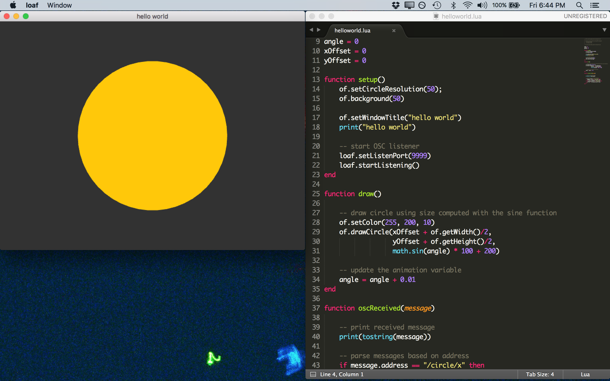

loaf: lua, osc, and openFrameworks
==================================

Copyright (c) [Dan Wilcox](danomatika.com) 2016-2020

GPL v3

For information on usage and redistribution, and for a DISCLAIMER OF ALL
WARRANTIES, see the file, "LICENSE.txt," in this distribution.

**loaf website**: [danomatika.com/code/loaf](http://danomatika.com/code/loaf)

DESCRIPTION
-----------

> cut off a slice of something nice

loaf is an interpreter for [openFrameworks](http://openframeworks.cc) which allows you to write OF applications in the [Lua](http://www.lua.org) scripting language. This means you can quickly create using openFrameworks but without having to compile C++ or use a heavy IDE like Xcode or Visual Studio. A built-in OSC (Open Sound Control) server enables loaf to communicate natively with other creative coding and music applications over a network connection. Additionally, a built-in Syphon server allows for streaming loaf's screen output to visual applications on the same macoS system.

> Is loaf a replacement for building a native C++ application?

No. If you need to be able to include openFrameworks addons, stay with C++ for now.

> So what is it for?

loaf is intended as a simple sandbox for sketching using the openFrameworks core API with a live-coding feel: make changes and see the result quickly. No compiling, no low level errors, just the basics. Think of loaf kind of like [Processing](http://processing.org) without the run button.

### Background

loaf is the result of the author's need for a visual coding tool for performance that can run almost anywhere and communicate with tools such as [Pure Data](http://puredata.info) or [Max MSP](https://cycling74.com/products/max/). Using Lua allows for loaf to react to script changes so the process of creation matches that of a dataflow environment like Pd. The native inclusion of OSC allows for coupling of loaf and other creative applications for experimentation.

loaf's design is influenced by the [LÖVE](https://love2d.org) Lua game engine and the [Fluxus](http://www.pawfal.org/fluxus/) live-coding environment. It is essentially the 3rd (or 4th) iteration of a similar tool for the author's [robotcowboy](http://robotcowboy.com) wearable performance project: [rc-visual](https://github.com/danomatika/rc-visual), originally a C++ application using [SDL](http://libsdl.org) which read XML scene descriptions and blitted to the console framebuffer. loaf is now used as the interpreter for rc-visual which is implemented completely in Lua and works with its controller input complement, [joyosc](https://github.com/danomatika/joyosc).

QUICK START
-----------

Download a release build from **[docs.danomatika.com/releases/loaf](http://docs.danomatika.com/releases/loaf/)** (currently macOS only) or build loaf after git cloning from [Github](https://github.com/danomatika/loaf)

Once you have a copy of loaf, drag the loaf.app into your Applications folder (macOS) or simple run it from the loaf folder by double-clicking.

_Note: A more comprehensive User Guide will be added in the future._

### Basic usage

* Drag a Lua script or folder with a main.lua onto loaf to run it
* Either save the script somehow (in a text editor) and/or use MOD+R in loaf to reload it automatically
* Toggle fullscreen with MOD+F
* Script errors are shown on the app window and on the console if you run it in a terminal application
* Prints are shown in the console (useful for debugging)
* The current script can be cleared with SHIFT+MOD+R

_The MOD key depends on the platform: macOS COMMAND, Windows/Linux CONTROL._

### Scripts, Folders, and Data Path

loaf supports opening Lua scripts (.lua) and folders which contain a main.lua file. The folder option is useful for project encapsulation. Any data file paths are automatically relative to the script's parent folder, ie. loading an image from script.lua in the following project layout:

    project/script.lua
    project/image.jpg

works like this:

    image = of.Image()
    image:load("image.jpg")

This also means Lua's require function works as expected when importing other Lua scripts or modules into  the main script.

### Using Lua and OF

A quick overview of using Lua and the Lua bindings for openFrameworks can be found in the [ofxLua readme](https://github.com/danomatika/ofxLua#of-api-bindings).

The best place to start is to look at the examples included with loaf zip and on the [loaf Github repo](https://github.com/danomatika/loaf/tree/master/examples).

There are also simple syntax lists for each of the built-in Lua bindings modules: of, osc, loaf, and syphon. These can be found in `doc/modules` and are a good place to start for creating auto-completion files for you favorite text editor.

### Syphon Support

On macOS, loaf includes support for Syphon via a built-in server and a Lua "syphon" module with bindings for the ofxSyphonClient, ofxSyphonServer, and ofxSyphonServerDirectory classes.

Similar to the built-in OSC sender and receiver instances, the Syphon server can
be accessed via loaf module Lua functions:

* loaf.startSyphon(): start server to publish screen each frame
* loaf.stopSyphon(): stop server
* loaf.setSyphonName(): set server name
* loaf.isSyphonPublishing(): is the server publishing right now?
* loaf.getSyphonServer(): get the built-in server instance

_Note: Make sure to call loaf.getSyphonServer() *only* after starting the server, otherwise the instance will not exist, i.e returns as "nil."_

Additionally, the "syphon" module allows for using Syphon directly in Lua scripts. See `examples/tests/syphon.lua`.

### Setting Window Size

By default, loaf starts as a 640x480 window. If you want a different resolution or to go fullscreen, you can simply call the corresponding OF functions in your script:

    function setup()
        of.setWindowShape(1024, 768) -- resizes the window, like Processing size()
        of.setFullscreen(true) -- go fullscreen! also the -f commandline option
    end

### loaf Commandline Options

loaf has a number of options which can be set when running it from the commandline, the most basic being a script to run:

    loaf path/to/script.lua

Use -h to print a usage help print:

~~~
Usage: loaf [options] [PATH [args]]

  lua, osc, and openFrameworks

Options:
  -h, --help       print usage and exit
  --version        print version and exit
  -a, --address    OSC host address to send to (default: localhost)
  -p, --port       OSC port to send to (default: 8880)
  -l, --listen     OSC port to listen on (default: 9990)
  -s, --start      start listening for OSC messages
  -f, --fullscreen start in fullscreen
  -i, --ignore     ignore script changes
  -e, --exit       exit after script error
  -r, --reload     reload timeout in secs after a script error
  --gl             try to set gl version to use ie. "4.1"
  --syphon-name    Syphon server name (default: screen)
  --syphon         start streaming screen with Syphon (macOS only)
  -v, --verbose    verbose printing

Arguments:
  PATH             optional lua script or folder to run
  args...          arguments to pass to the lua script
~~~

You can also pass arguments to the script itself by placing them after the script path:

    loaf script.lua hello 123

See the argument test script for more details: `examples/tests/arg.lua`

#### macOS Terminal alias

On macOS, you can run a .app from Terminal by calling the binary hidden inside the application bundle:

    /Applications/loaf.app/Contents/MacOS/loaf -h

To make this less cumbersome, you can add an alias in your .bash_profile:

    alias loaf="/Applications/loaf.app/Contents/MacOS/loaf"

which allows you to call loaf with just the short alias instead:

    loaf -h

### Libraries

As loaf contains the Lua embedded scripting language, pure Lua libraries will work fine with it. Pre-compiled loadable Lua modules will also work as long as they are found within the `require` search path.

Also, a set of loaf-oriented Lua libraries is available in the [loaf-ingredients](https://github.com/danomatika/loaf-ingredients) repository.

BUNDLING INTO STAND-ALONE APPS
------------------------------

As of loaf 1.6.0, loaf projects can be "bundled" into stand-alone applications. If a "main.lua" script is found on startup, it will be used by default:

* Windows / Linux: "data" folder next to loaf executable, `./data/`
* macOS: "data" folder within a macOS .app bundle, `../Resources/data/`

The loaf executable can also be renamed.

### macOS

A macOS .app bundle is basically a folder structure presented by Finder as an "application." It contains the application executable, dependent libraries, and resource files. This structure can be created & modified to make your own application which can then be distributed to run on other macOS systems.

To facilitate creating a stand-alone .app from a loaf project, the `scripts/make_osxapp.sh` shell script can make a copy of an existing loaf.app and use it to create a new application by copying the loaf project Lua scripts and data files inside the bundle. Additionally, it can modify metadata such as the application name, version string, and icon.

For example.

    ./scripts/make_osxapp.sh -l bin/loaf.app ~/Desktop/loaf-project LoafProject

will create a `LoafProject.app` using the files in `~/Desktop/loaf-project`.

See the `make_osxapp.sh` help output for more info:

    ./scripts/make_osxapp.sh --help

BUILDING LOAF
-------------

To build loaf, you will need a copy of openFrameworks: [http://openframeworks.cc/download/](http://openframeworks.cc/download/)

loaf requires the following addons:

* [ofxLua](https://github.com/danomatika/ofxLua)
* ofxOsc (included with openFrameworks)
* [ofxSyphon](https://github.com/astellato/ofxSyphon) (optional, macOS-only)

Project files for building loaf on Windows or Linux are not included so you will need to generate them for your operating system and development environment using the OF ProjectGenerator which is included with the openFrameworks distribution.

To (re)generate project files for an existing project:

* Click the "Import" button in the ProjectGenerator
* Navigate to the base folder for the project ie. "loaf"
* Click the "Update" button

If everything went Ok, you should now be able to open the generated project and build/run the example.

### macOS

Open the Xcode project, select the "loaf Release" scheme, and hit "Run". Once built, the loaf.app is found in the `bin` directory.

For a Makefile build with Syphon (default), build and run on the terminal:

    make ReleaseLoaf
    make RunRelease

If not using Syphon, use the default make target:

    make Release

#### Updating Xcode Project After Generation

If the project is (re)generated using the OF ProjectGenerator, the openFrameworks-Info.plist file will be overwritten and these changes can be reversed with:

    git checkout openFrameworks-Info.plist

#### Enabling Syphon Support

Syphon support must be enabled as a compile-time option using the `LOAF_USE_SYPHON` C++ define.

* Select loaf project in the Xcode file tree
* Select loaf under PROJECT list and Build Settings tab
* Find Other C++ flags and add: `-DLOAF_USE_SYPHON`

If doing a Makefile build, use the additional targets which will also install the Syphon framework into loaf.app: `DebugLoaf` & `ReleaseLoaf`.

#### Fixing Unknown option "NSDocumentRevisionsDebugMode"

If running the project does nothing except for showing the following console output:

    Unknown option "NSDocumentRevisionsDebugMode"

Edit the Debug and Release schemes and uncheck "Document Versions" in Run->Options tab.

### Linux

To build and run on the terminal:

    make
    make run

### Windows

_Instructions for Visual Studio to be added here. Contributions are welcome._

DEVELOPING
----------

You can help develop ofxLua on GitHub: https://github.com/danomatika/loaf

Create an account, clone or fork the repo, then request a push/merge.

If you find any bugs or suggestions please log them to GitHub as well.
